# Deliverable 2 Submission

## Virtual Machine Hardware Configuration
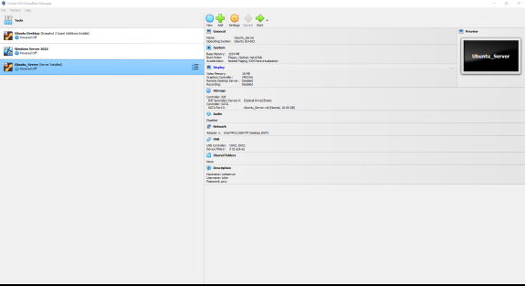

## Server Login
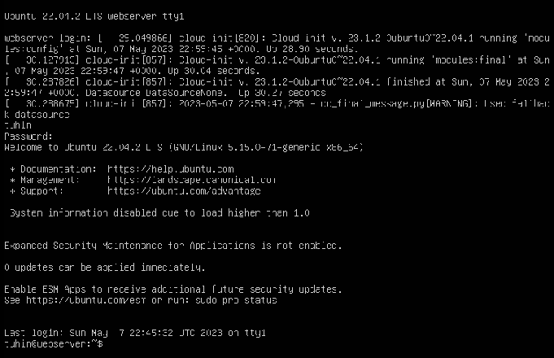

## SSH Login
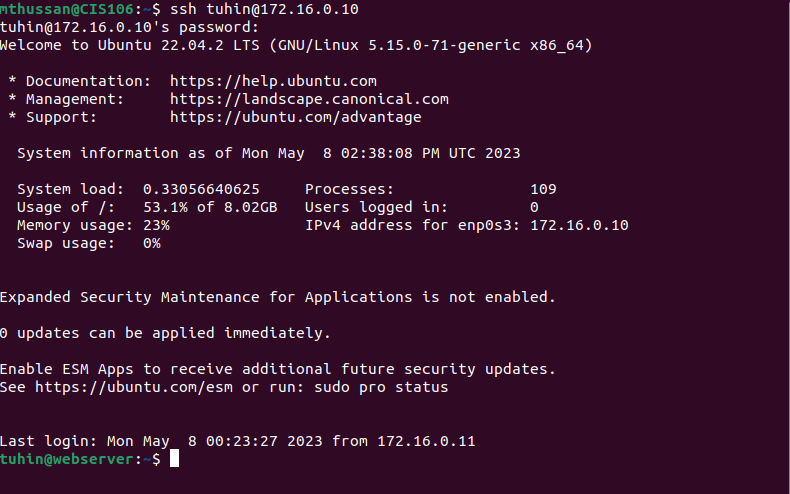

## Systemctl Commands
This is a screenshot of the 'systemctl status apache2 --no-pager' command:
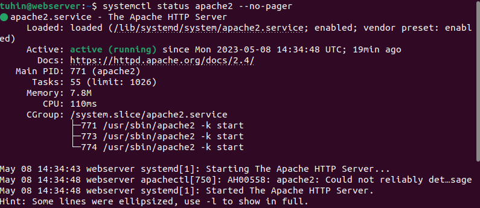

This is a screenshot of the 'systemctl status sshd --no-pager' command:
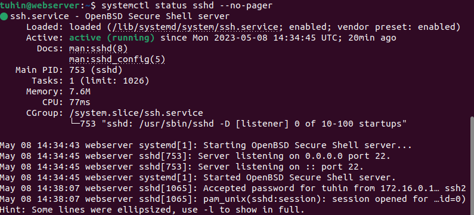

This is a screenshot of the 'systemctl status ufw --no-pager' command:
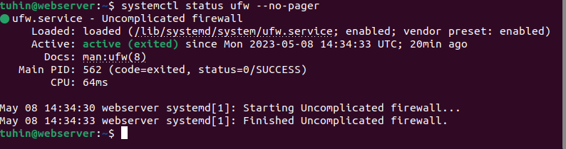

## Log Files
This is a screenshot of the Apache log file: access.log:
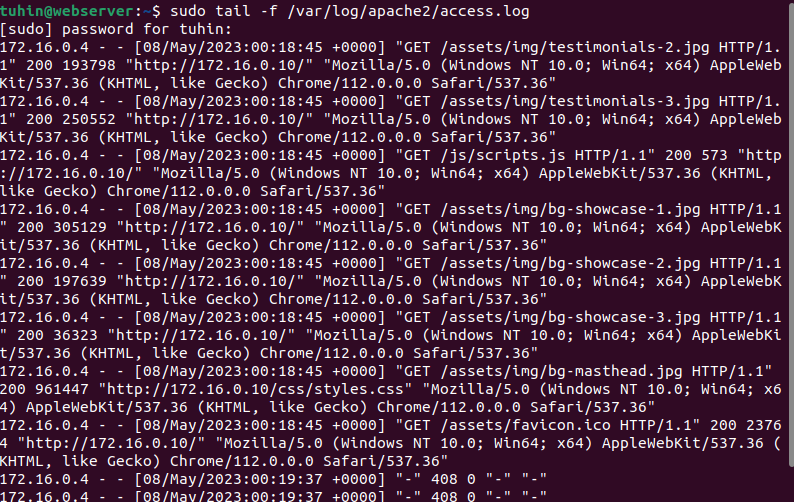

This is a screenshot of the Apache log file: error.log:
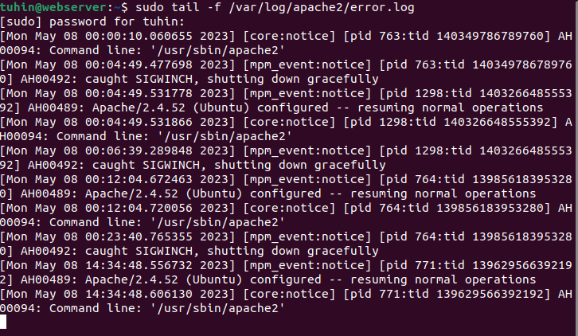

This is a screenshot of the SSH log file: auth.log:
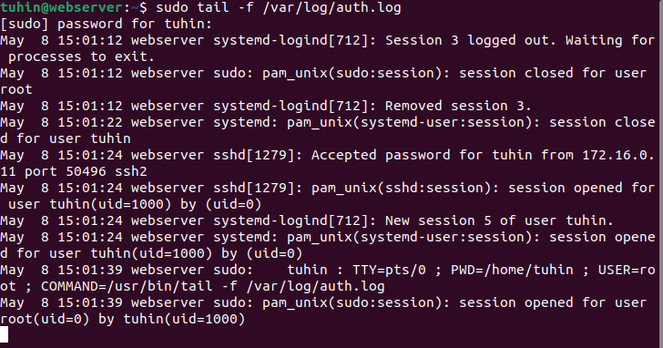

## Configuration
This is a screenshot of the sites-available config file:
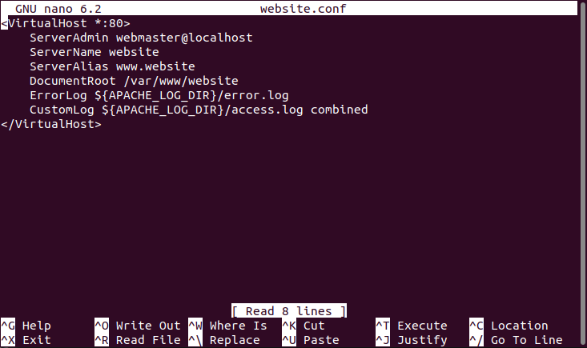

This is a screenshot of the apache2.conf:
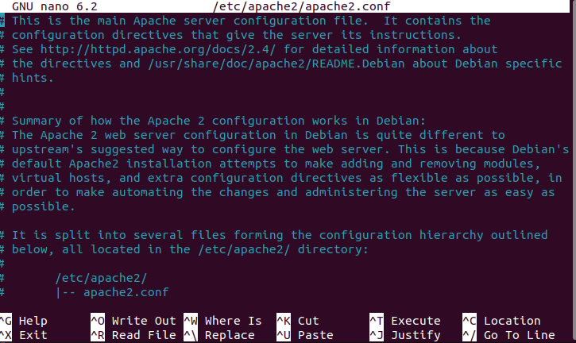

## Server IP Address and Website Access
This is a screenshot of the server's IP:
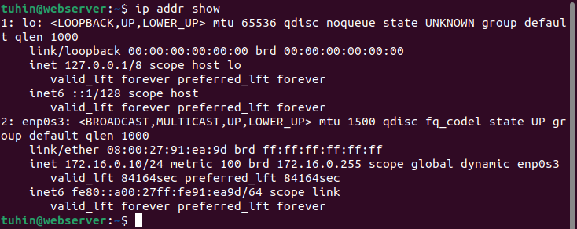

This is a screenshot of the created website being accessed:
