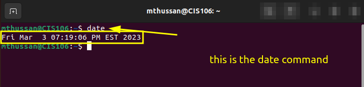
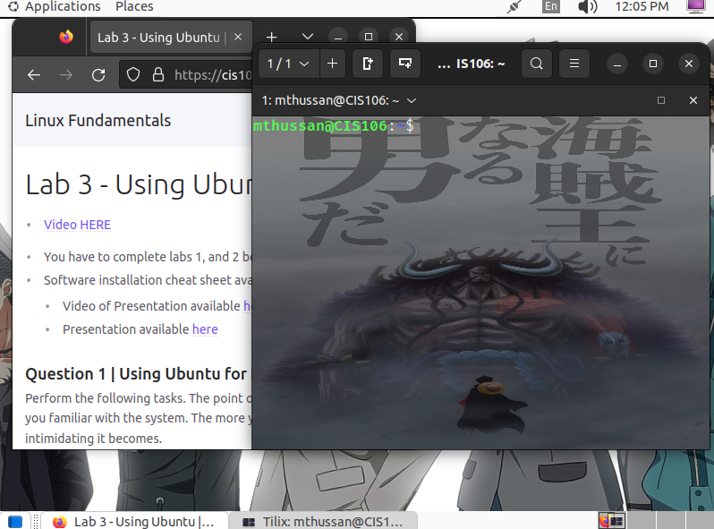

# Lab 3 Submission

## Question 1 

## Question 2

## Question 3

| Program purpose     | Package Name     | Version            |
| ------------------- | ---------------- | ------------------ |
| Play a tetris game  | blockattack      | 2.8.0-1            |
| Play a video file   | dragonplayer     | 4:22.08.1-0ubuntu1 |
| Browse the internet | epiphany-browser | 43.0-1             |
| Read your email     | geary            | 40.0-7             |
| Play music          | elisa            | 22.08.2-0ubuntu1   |

## Question 4

| command | what it does                               |
| ------- | ------------------------------------------ |
| echo    | displays text on screen                    |
| fortune | displays a random message                  |
| cowsay  | displays a cow                             |
| lolcat  | displays lines in color                    |
| figlet  | displays messages using large letters      |
| toilet  | prints big messages using small characters |
| rig     | creates names and addresses                |
