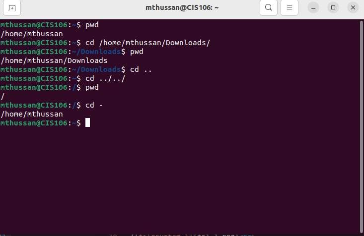
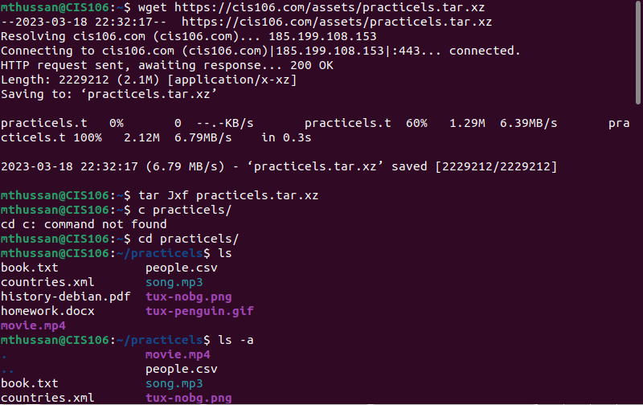
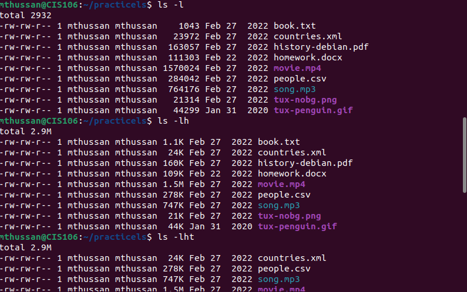
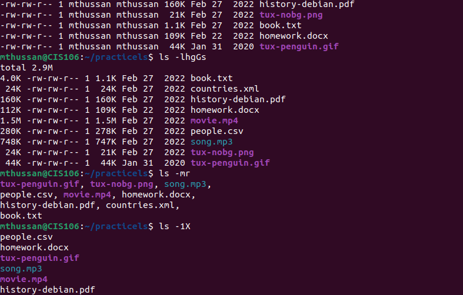
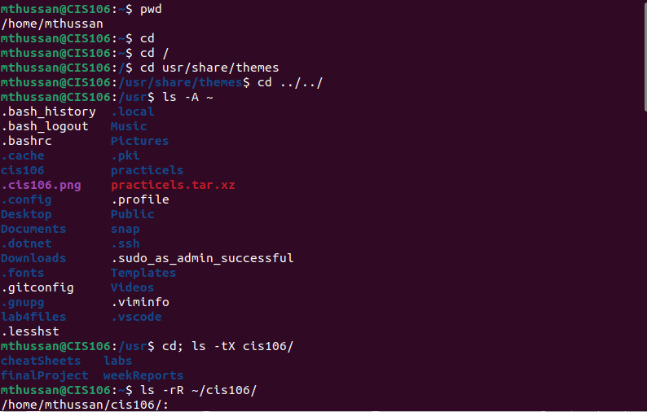
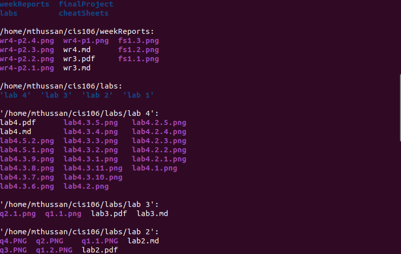
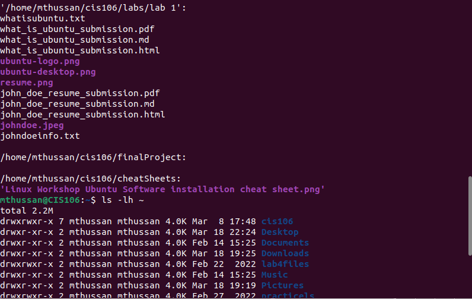
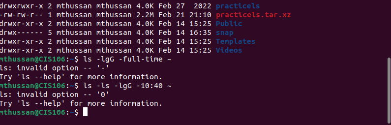

# Week Report 4

## Practice From The Presentation The Linux File System:
### Practice 1
 

### Practice 2
 
 
 
 

### Practice 3
 
 
 
 

## The Linux File System Directories and Their Purpose:

 
 
 

## All The Commands For Navigating the Filesystem

| Command | What It Does                                              | Syntax              | Example                   |
| ------- | --------------------------------------------------------- | ------------------- | ------------------------- |
| pwd     | prints current directory                                  | pwd                 | `pwd`                     |
| cd      | Changes the current directory to a specified directory.   | cd [DIRECTORY]      | `cd /home/user/documents` |
| ls      | Lists the files and directories in the current directory. | ls [OPTIONS] [FILE] | `ls /home/user/documents` |

## Basic Terminology
* **File System:** A file system is a method used to organize and store files on a computer. It defines the way files are named, stored, retrieved, and updated on a storage device, such as a hard disk drive, solid-state drive, or USB drive.
* **Current Directory:** The current directory is the directory that a user is currently working in, or the directory that is currently displayed in a terminal or file manager.
* **Parent Directory:** The parent directory is the directory that contains the current directory. It is represented by two dots ".." and can be used in a file path to navigate up one level in the directory tree.
* **The difference between between your home directory and the home directory:** "your home directory" refers to the specific directory that is assigned to the current user as their personal directory, while "the home directory" refers to the directory that contains all home directories on the system.
* **pathname:** A pathname is a string that specifies the location of a file or directory in a file system. It can be represented as an absolute path or a relative path.
* **relative path:** A relative path is a pathname that specifies the location of a file or directory relative to the current directory. It does not start with a slash (/) and may include special characters like ".." to navigate up in the directory tree.
* **absolute path:** An absolute path is a pathname that specifies the exact location of a file or directory in a file system. It starts with a slash (/) and includes the entire directory path from the root directory to the file or directory.