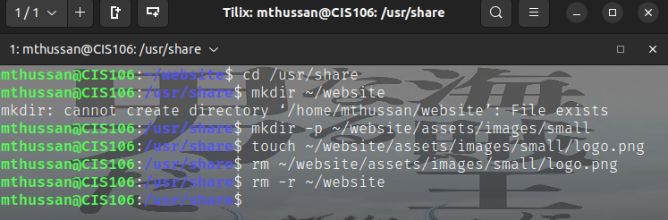
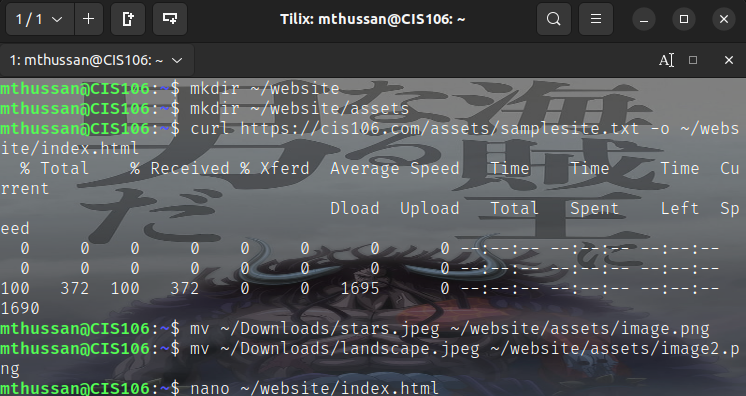
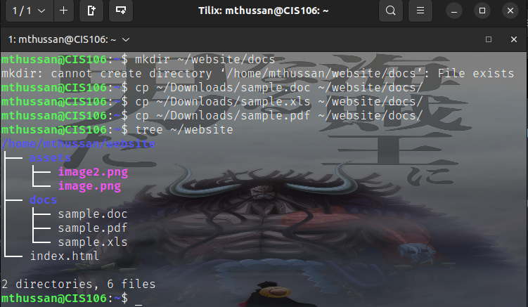

# Week Report 5

## Answer To Questions:

* **What are Command Options?**
Additional parameters that can be added to a command to modify or customize its behavior. They usually start with a hyphen (-) followed by a letter or word, and can be combined together to form more complex options.
  
* **What are Command Arguments?**
Inputs that are passed to a command to specify what it should act on or how it should perform its task.

* **Which command is used for creating directories? Provide at least 3 examples.**
The command is mkdir.
* example 1:
  * Create a directory: `mkdir potatoes`
* example 2:
  * Create multiple directories: `mkdir movies ~/Downloads/games ~/Documents/hmw `
* example 3:
  * Create a directory inside of a directory: `mkdir data/backup`
  
* **What does the touch command do? Provide at least 3 examples.**
Creates a new empty file or updates the modification and access times of an existing file.
* example 1:
  * Create new file inside of current directory: `touch index.html`
* example 2:
  * Create multiple files: `touch file1.txt file2.txt file3.txt`
* example 3:
  * Update modification time of existing file: `touch data.txt`
* **How do you remove a file? Provide an example.**
The "rm" command followed by the name of the file you want to delete. For example, to remove a file called "myfile.txt", you would use the command: `rm myfile.txt`

* **How do you remove a directory and can you remove non-empty directories in Linux? Provide an example**
If the directory is empty, you can use the "rmdir" command. You can use the "rm" command with the "-r" option if it is not empty. For example:
To remove an empty directory called "mydir":
rmdir mydir

To remove a non-empty directory called "myfolder" and all its contents:
rm -r myfolder

* **Explain the mv and cp command. Provide at least 2 examples of each**
The "mv" command is used to move or rename files and directories, while the "cp" command is used to copy files and directories.
* example 1:
  * Move a file to another directory: `mv file1.txt backup/`
* example 2:
  * Rename a file: `mv oldname.txt newname.txt`

* example 1:
  * Copy a file from the current directory to another one: `cp file1.txt backup/` 
* example 2: Copy a directory to another directory: `cp -r myfolder backup/`
  
## Practice 1
  

## Practice 2
  

## Practice 3
  

## Practice 4
  